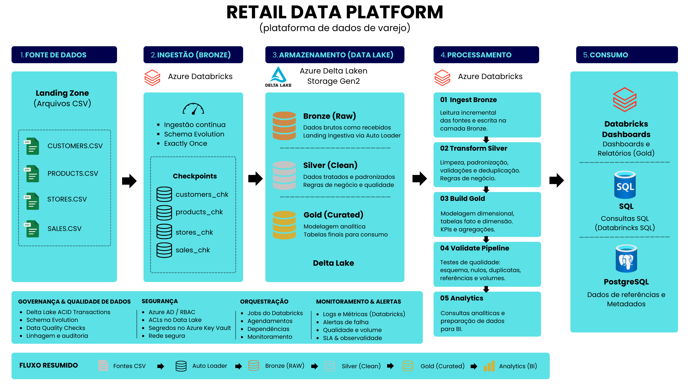

# 🛒 Retail Data Platform

Projeto end-to-end de Engenharia de Dados que simula uma plataforma de dados para uma empresa do setor varejista, utilizando Microsoft Azure e Databricks.

O projeto implementa um pipeline de dados incremental baseado na Arquitetura Medalhão (Bronze, Silver e Gold), abrangendo ingestão, transformação, qualidade dos dados, modelagem dimensional, orquestração, observabilidade e disponibilização dos dados para análise.

## 🎯 Objetivo do Projeto

O objetivo é simular uma plataforma de dados capaz de processar informações de clientes, produtos, lojas e vendas de uma empresa varejista.

A solução foi desenvolvida para:

- Gerar dados sintéticos representativos de um ambiente de varejo;
- Armazenar os arquivos brutos no Azure Data Lake Storage Gen2;
- Realizar ingestão incremental utilizando Databricks Auto Loader;
- Organizar os dados através da Arquitetura Medalhão;
- Aplicar regras de qualidade e validação;
- Isolar registros inválidos através de uma camada de quarentena;
- Construir um modelo dimensional no formato Star Schema;
- Orquestrar o pipeline utilizando Lakeflow Jobs;
- Monitorar métricas operacionais e de qualidade;
- Disponibilizar indicadores de negócio através de um dashboard interativo.

---

## 🏗️ Arquitetura da Solução



---

### Fluxo de Dados

**Landing → Bronze → Silver → Gold → Analytics**

- **Landing Zone:** recebe os arquivos CSV de clientes, produtos, lojas e vendas.
- **Bronze:** preserva os dados ingeridos em sua forma bruta.
- **Silver:** realiza limpeza, padronização, deduplicação e validações.
- **Gold:** disponibiliza dados modelados e preparados para análise.
- **Analytics:** fornece consultas, KPIs e visualizações para consumo analítico.

A ingestão utiliza **Databricks Auto Loader** com checkpoints independentes,
permitindo processamento incremental e controle do estado de cada fonte.

---

## 🧰 Tecnologias Utilizadas

| Tecnologia | Utilização |
|---|---|
| Python | Geração e processamento inicial dos dados |
| Faker | Geração de dados sintéticos |
| PostgreSQL | Banco relacional utilizado durante o desenvolvimento |
| Microsoft Azure | Infraestrutura em nuvem |
| Azure Data Lake Storage Gen2 | Armazenamento e Landing Zone |
| Azure Databricks | Plataforma de processamento |
| Apache Spark / PySpark | Transformações distribuídas |
| Spark Structured Streaming | Processamento incremental |
| Databricks Auto Loader | Ingestão incremental de arquivos |
| Delta Lake | Armazenamento das tabelas |
| Unity Catalog | Organização e governança dos dados |
| Databricks Lakeflow Jobs | Orquestração do pipeline |
| Data Quality Monitoring | Monitoramento de qualidade |
| Databricks AI/BI | Construção do dashboard |
| SQL | Validações, consultas e análises |
| Git / GitHub | Versionamento e documentação |

---

## 📂 Domínios de Dados

A plataforma processa quatro conjuntos principais de dados.

### Clientes

Informações cadastrais e geográficas dos clientes.

### Produtos

Catálogo contendo informações sobre produtos, categorias, marcas e preços.

### Lojas

Dados cadastrais e geográficos das lojas.

### Vendas

Dados transacionais responsáveis por relacionar clientes, produtos e lojas.

---

## 🥉 Camada Bronze

A camada Bronze é responsável por armazenar os dados provenientes da Landing Zone com o mínimo possível de transformação.

A ingestão incremental foi implementada utilizando:

- Databricks Auto Loader;
- Spark Structured Streaming;
- Delta Lake;
- Checkpoints.

Cada fonte possui seu próprio:

```text
schemaLocation
checkpointLocation
```

Isso garante isolamento entre os estados de processamento de:

```text
customers
products
stores
sales
```

Principais tabelas:

```text
retail.bronze.customers_auto
retail.bronze.products_auto
retail.bronze.stores_auto
retail.bronze.sales_auto
```

---

## 🥈 Camada Silver

A camada Silver é responsável pela limpeza, padronização e validação dos dados.

Entre os tratamentos realizados estão:

- Conversão de tipos;
- Padronização das colunas;
- Tratamento de valores inválidos;
- Remoção de duplicidades;
- Aplicação de regras de negócio;
- Validação de integridade referencial.

Os registros de vendas que não atendem às regras de qualidade são separados dos registros válidos.

```text
retail.silver.sales
retail.silver.sales_quarantine
```

Dessa forma, um registro inválido pode ser analisado posteriormente sem contaminar a camada analítica.

O fluxo é:

```text
Bronze
   │
   ▼
Validação
   │
   ├────────── válido ──────────► Silver
   │
   └───────── inválido ─────────► Quarantine
```

---

## 🥇 Camada Gold

A camada Gold disponibiliza dados preparados para consumo analítico.

Foi implementado um modelo dimensional no formato **Star Schema**.

```text
                    dim_customers
                          │
                          │
dim_products ─────── fact_sales ─────── dim_stores
                          │
                          │
                       dim_date
```

A tabela fato centraliza as métricas de vendas, enquanto as dimensões fornecem os diferentes contextos para análise.

Principais tabelas:

```text
retail.gold.fact_sales
retail.gold.dim_customers
retail.gold.dim_products
retail.gold.dim_stores
retail.gold.dim_date
```

---

## 📦 Data Products

Além do modelo dimensional, foram construídos conjuntos analíticos para diferentes perspectivas de negócio.

Entre eles:

- Vendas diárias;
- Performance de produtos;
- Performance das lojas;
- Customer 360;
- Análise de receita;
- Análise de lucro;
- Ticket médio;
- Margem de lucro.

Esses dados servem como base para análises e dashboards.

---

## ⚙️ Orquestração

O pipeline completo foi automatizado utilizando **Databricks Lakeflow Jobs**.

O workflow segue a seguinte dependência:

```text
ingest_bronze
      │
      ▼
transform_silver
      │
      ▼
build_gold
      │
      ▼
validate_quality
```

Dessa forma, cada etapa somente é iniciada após a conclusão bem-sucedida de sua dependência.

Também foram configuradas políticas de retry para aumentar a resiliência diante de falhas transitórias.

---

## 🔍 Qualidade e Observabilidade

A solução possui mecanismos nativos e customizados para acompanhamento da qualidade dos dados.

### Data Quality Monitoring

O monitoramento foi habilitado sobre a tabela fato da camada Gold para acompanhamento de indicadores como:

- Freshness;
- Completeness.

### Monitoramento customizado

Também foi criada a tabela:

```text
retail.monitoring.pipeline_quality
```

Ela mantém snapshots das principais métricas do pipeline.

Entre as métricas armazenadas estão:

```text
bronze_sales
silver_sales
quarantine_sales
gold_sales
rejection_rate
duplicated_sales
```

Isso permite acompanhar historicamente a saúde do pipeline.

---

## 🚨 Alertas

Foram implementadas condições para identificação de situações anormais, como:

```text
Taxa de rejeição > limite definido

Duplicidades > 0

Gold sem registros
```

Também foram configuradas notificações de falha na execução do pipeline.

---

## 📊 Analytics e Dashboard

Foi desenvolvido um dashboard executivo utilizando Databricks AI/BI.

### Principais KPIs

O dashboard apresenta:

- Receita Total;
- Lucro Total;
- Margem de Lucro;
- Ticket Médio.

### Análises

Também foram implementadas visualizações de:

- Evolução da receita e lucro;
- Receita por região;
- Performance por categoria;
- Top 10 produtos;
- Performance das lojas;
- Vendas por forma de pagamento.

O dashboard possui filtros interativos por:

```text
Período
Região
Categoria
```

As métricas são recalculadas dinamicamente de acordo com o contexto selecionado.

---

## 🧪 Validação do Pipeline

Além da execução do pipeline, foram realizados testes para validar sua confiabilidade.

### Idempotência

O pipeline foi executado novamente sem a disponibilização de novos arquivos.

O comportamento esperado foi:

```text
RUN #1
Arquivos processados
        ↓
Dados persistidos

RUN #2
Nenhum arquivo novo
        ↓
Nenhuma nova ingestão
        ↓
Dados existentes preservados
        ↓
Sem duplicação
```

Esse teste permitiu validar o comportamento incremental do Auto Loader e a persistência das tabelas Delta.

### Duplicidades

Foram realizadas validações para garantir que `sale_id` duplicados não contaminassem a camada analítica.

### Integridade referencial

Os registros de vendas são validados contra clientes, produtos e lojas existentes.

Registros que não atendem às regras são direcionados para a quarentena.

---

## 📊 Resultado da Validação

Em uma das execuções utilizadas para validação do pipeline:

```text
Bronze Sales       100.105
Silver Sales       100.100
Gold Fact Sales    100.100
Quarantine               5
```

Isso demonstra que os registros inválidos foram isolados enquanto os registros válidos continuaram normalmente pelo pipeline.

---

## 🛠️ Problemas Encontrados e Decisões de Engenharia

Durante o desenvolvimento foram encontrados diferentes problemas que exigiram investigação e correção.

### 1. Isolamento dos checkpoints

**Problema**

O estado do processamento incremental precisa ser independente para cada fonte de dados.

**Solução**

Foram utilizados `schemaLocation` e `checkpointLocation` separados para:

```text
customers
products
stores
sales
```

Isso evitou conflitos de schema e estado entre os diferentes streams.

### 2. Estado do Auto Loader x estado da tabela

Durante o desenvolvimento, comandos de:

```sql
DROP TABLE
```

permaneceram temporariamente no notebook de ingestão.

Na primeira execução, os dados eram carregados normalmente.

Na segunda execução:

```text
DROP TABLE
      ↓
Tabela removida
      ↓
Checkpoint informa que os arquivos já foram processados
      ↓
Auto Loader encontra 0 arquivos novos
      ↓
Tabela permanece vazia
```

**Solução**

As operações destrutivas utilizadas durante o desenvolvimento foram removidas do fluxo definitivo.

Foi realizado um reset controlado do estado do Auto Loader e posteriormente o pipeline foi executado novamente para validar a idempotência.

### 3. Inconsistência de schemas

Arquivos incrementais apresentaram diferenças em campos de data/hora.

**Solução**

Os schemas e campos temporais foram padronizados antes do processamento das camadas posteriores.

---

## 💡 Principais Aprendizados

O desenvolvimento deste projeto permitiu aplicar conceitos importantes de Engenharia de Dados, como:

- Arquitetura Medalhão;
- Processamento incremental;
- Structured Streaming;
- Gerenciamento de checkpoints;
- Delta Lake;
- Qualidade de dados;
- Quarantine;
- Modelagem dimensional;
- Star Schema;
- Orquestração;
- Observabilidade;
- Idempotência;
- Troubleshooting de pipelines;
- Construção de métricas analíticas.

Um dos principais aprendizados foi compreender que:

> O estado do streaming, o estado das tabelas e os arquivos de origem são componentes diferentes e precisam ser gerenciados de maneira consistente.

---

## 🚀 Próximas Evoluções

Como evolução da plataforma, poderão ser implementados:

- CI/CD;
- Infrastructure as Code com Terraform;
- Testes unitários e de integração automatizados;
- SCD Type 2;
- Monitoramento de custos;
- Alertas mais avançados;
- Integração com Power BI;
- Novas fontes de dados;
- Processamento em tempo real.

---

## 👨‍💻 Autor

Projeto desenvolvido como parte de um portfólio de **Engenharia de Dados**, com foco na construção de uma plataforma end-to-end utilizando Azure, Databricks, Spark e Delta Lake.